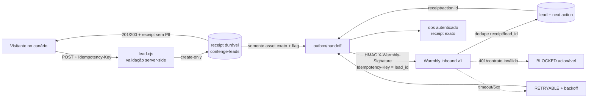

# #230 em #61 — canário único de segunda leitura contratual

Data da auditoria: 2026-08-22 BRT (2026-08-23 UTC). Base: `origin/main` em
`2e9aa14a1d26ff09c689ae861adab59bad6be91f`.

## Decisão e hipótese

- Estado: **EXECUTE_NOW** (P0), frente **REVENUE NOW**.
- Canário único: `/ferramentas/diagnostico-defesa-margem/`, CTA “Quero uma
  segunda leitura deste contrato”. Nenhuma rota, página, schema ou regra de
  robots foi criada.
- Trabalho do visitante: pedir uma conferência humana do contrato que acabou de
  consultar, sem perder o pedido quando Warmbly estiver lento ou indisponível.
- Hipótese: um pedido contextual com receipt confirmado e handoff reconciliável
  converte intenção contratual em oportunidade tratável com menos perda e menos
  duplicação.
- Evidência esperada: um dia para preview; produção somente após aprovação normal
  do deploy.
- Alavancas: receita, automação e confiança. Cem repetições melhoram o sistema
  porque alimentam o mesmo receipt, dedupe, outbox e atribuição; não criam cem
  operações manuais.
- North Star: oportunidade comercial qualificada. Clique, `201` e page count não
  são sucesso corporativo.

## Auditoria antes do slice

| Superfície | Evidência observada | Estado antes |
|---|---|---|
| CTA/form live | Página `200`, indexável, utilidade antes do CTA e copy honesta; o form live ainda tinha `action=/obrigado` e status sem live region | podia renderizar agradecimento sem receipt no caminho sem JS |
| Captura | Prova anterior retornou `201`, replay `200`, mesmo `lead_id` e sem PII na resposta | persistência e dedupe local provados |
| Handoff live | Prova autenticada em `97d8338`: `persisted_leads=124`, `skipped=124`, `delivered=0`, URL/secret/contrato `UNSET` | loop produção bloqueado, não DONE |
| Auth ops | health público reportou `auth_configured=true`; `inbound_handoff` sem token retornou `401` | fail-closed |
| Warmbly | health `200 READY`, `auto_send_enabled=false`; GET não assinado no ingest retornou `403` | receptor pronto e autenticado; segredo de produção ainda precisava ser ligado no emissor |
| BOFU | `test:bofu-audit`: 15 testes aprovados | sem abrir campanha de 128 rotas |

Fonte do baseline operacional:
`docs/evidence/bofu-production-closure/inbound-counters-proof-32610623004.json`.

## Fluxo entregue

O servidor valida e normaliza antes de persistir. O receipt é gravado com
`onlyIfNew` antes de qualquer POST downstream. O handoff usa o contrato
`confenge.inbound.v1`, HMAC com timestamp, a mesma chave idempotente e a política
de backoff já versionada (30 s, 60 s, 2 min, 5 min, 15 min, 1 h e 4 h; máximo 8
tentativas). `5xx`/timeout ficam `RETRYABLE`; `401` e contrato inválido ficam
`BLOCKED`; falha do Warmbly não apaga nem transforma a captura em erro falso.

## Limite do canário e rollback

Três guards server-side impedem expansão acidental:

1. `CONFENGE_INBOUND_CANARY_ENABLED=1`;
2. `CONFENGE_INBOUND_CANARY_ASSET_ID=diagnostico-defesa-margem` exatamente;
3. `asset_id=diagnostico-defesa-margem` no receipt validado.

Qualquer outro asset recebe `SKIPPED/outside_canary`, mesmo se URL ou segredo
estiverem incorretos. O kill switch é colocar
`CONFENGE_INBOUND_CANARY_ENABLED=0`; captura persist-first continua ativa. Reverter
o PR remove a UI/observabilidade nova, mas não apaga receipts já persistidos.

O probe de produção exige ainda `X-Confenge-Probe` válido, marker
`record_kind=synthetic`, `test_mode=true` e
`CONFENGE_INBOUND_SYNTHETIC_CANARY_ENABLED=1`. O corpo público não pode se
autoclassificar como sintético. Após a prova, a flag sintética volta a `0`; o
registro permanece/é arquivado como sintético, excluído da fila e dos
denominadores comerciais reais.

## Atribuição e privacidade

- Fonte normalizada: `CONFENGE_WEB`.
- Contexto: `asset_id=diagnostico-defesa-margem`,
  `route_family=defesa-margem-diagnostico`,
  `cta_id=segunda-leitura-contrato` e landing/origem da página.
- Não existe oferta precificada/catalogada para este CTA; por isso nenhum
  `offer_id` foi inventado. O contexto honesto da oferta é o asset + CTA de
  segunda leitura.
- Analytics recebe apenas dimensões allowlisted; nome, email, telefone e mensagem
  não são enviados. URLs de atribuição perdem query/fragment e UTM/IDs aceitam
  somente tokens, impedindo PII injetada de chegar a receipt, URL operacional,
  logs ou analytics.
- O receipt público contém ID opaco e estados técnicos, nunca os campos livres.

## #179 e correções móveis/a11y do canário

A causa concreta de #179 foi `max-width:100%` sem neutralizar o `height=630` da
capa 1200×630, produzindo aproximadamente 348×628 em 390 px. O `main` de partida
já contém o merge `2086e713` (#253), que mantém essas title cards apenas como OG
nas rotas elegíveis, e a suíte geométrica cobre artigo/pilar em 320, 390, 768,
1024 e 1440 px. O canário escolhido não tem `.article-cover`, portanto não seria
honesto atribuir #179 a ele.

No canário, o teste móvel encontrou dois blockers reais de overflow: honeypot
posicionado fora da tela e URL longa na lista de fontes gerada em runtime. Foram
corrigidos somente em `styles-tools.css`, com ocultação visual recortada e quebra
segura da fonte. Axe também encontrou `#metodo` fora de landmark nomeado; a seção
recebeu nome acessível. Não houve redesign.

## Evidência depois do slice (local e preview)

| Gate | Resultado |
|---|---|
| Unitário de lead | 18 PASS, incluindo validação, persistência, idempotência e injeção de PII em atribuição |
| Contrato/handoff | 22 PASS: HMAC, persist-before-destination, dedupe, 5xx, timeout, 401, flags, requeue restrito ao canário e sintético autenticado |
| Loop integrado | mesmo receipt web-cfg/Warmbly, `downstream_receipt=wb-<lead_id>`; 1 delivered, 1 blocked, 1 retryable e 2 skipped em fixtures isoladas |
| E2E Chromium 390 px | refresh manteve chave; timeout + reenvio deixou 1 receipt; duplicata não repostou; Warmbly 503 preservou `RETRYABLE`; sem overflow |
| A11y | 14 páginas no preview Netlify, incluindo o canário: 0 critical, 0 serious, 0 moderate, 0 minor |
| UI/#179 | suíte geométrica completa PASS; `image-aspect-ratio=1`, `image-size-responsive=1` |
| BOFU | 15 PASS |
| Analytics/atribuição | PASS; allowlist sem PII; qualified/pipeline continuam `UNKNOWN` até evento real |
| Build | PASS; 0 páginas pSEO publicáveis, 5 noindex, 18 rejeitadas; mudanças geradas fora do slice descartadas |
| Performance | preview Netlify: performance 92, a11y 100, LCP 1,71 s, CLS 0 e checks de proporção/responsividade de imagem aprovados. Baseline live: performance 98, a11y 100, best practices 96, SEO 100, LCP 2,08 s, CLS 0 |

Lint editorial e `node --check` dos entrypoints/bundle também passaram. Os módulos
em `js/modules/` são fragmentos concatenados e não são entrypoints JS autônomos.
No preview, best practices 93 decorreu das injeções do toolbar Netlify
(CSP/permissions) e SEO 69 do `X-Robots-Tag: noindex` deliberado do ambiente de
preview; não são mudanças da rota. A produção de referência permaneceu em 96 e
100, respectivamente.

## Gate de produção e resíduos

Ainda não é DONE em produção. Após aprovação normal do deploy:

1. conferir no ops autenticado que as duas flags do canário, URL, segredo e
   contrato estão `READY`;
2. manter `CONFENGE_AUTO_SEND_ENABLED=false` no Warmbly;
3. abrir por tempo limitado a flag sintética e rodar
   `npm run probe:money-asset:prod` com `OPS_TOKEN`, `LEAD_PROBE_SECRET` e evidência
   de auto-send off;
4. exigir o mesmo `lead_id/receipt_id`, `record_kind=synthetic`, source, asset,
   `handoff.status=DELIVERED` e `downstream_receipt` Warmbly;
5. desligar a flag sintética e arquivar/reter o registro como sintético.

Resíduos explícitos: aprovação/deploy, configuração secreta de produção e
reconciliação do lead sintético. Um clique ou HTTP 200/201 isolado não
fecha #230. Pipeline real qualificado permanece `UNKNOWN`; a prova sintética mede
somente o transporte receipt → handoff → pipeline excluído.

## Contratos e ADRs

- Dono dos fatos, identidade e proveniência: `extra-cli`, consumido SELECT-only;
  sem crawler/DataLake/identidade paralela.
- Dono da ação comercial: Warmbly, source `CONFENGE_WEB` e contrato versionado.
- Superfície pública única: CONFENGE; nenhum branding/runtime/URL SmartLic.
- ADR afetado: `ADR-STRAT-002`, sem mudança de fronteira. O slice também respeita
  `RUNTIME-AUTHORITY` e `MARKET-CAPTURE-OS`.
