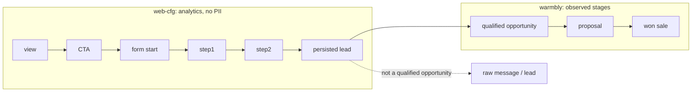

# Funil fechado visita → oportunidade → receita

Visitor analytics and Warmbly commercial stages stay two layers, joined only by stable non-PII ids. Qualified / proposal / won are observed inputs. They are never derived from `page_view`, CTA, form or `lead_persisted`.

Join keys (prefixes, never email / phone / free text):

| Entity | Prefix | Field |
| --- | --- | --- |
| session | `sess-` | `session_id` |
| lead | `lead-` | `lead_id` |
| opportunity | `opp-` | `opportunity_id` |
| proposal | `prop-` | `proposal_id` |
| sale | `sale-` | `sale_id` |

CI proof: `scripts/revops/fixtures/closed-loop-synthetic.v1.json` and `npm run revops:closed-loop`. Production counts stay out of this fixture report.
