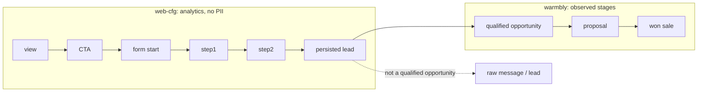

# Funil fechado visita → oportunidade → receita

Visitor analytics and Warmbly commercial stages stay two layers, joined only by stable non-PII ids. `web-cfg` ends at persisted receipt. Qualified / proposal / won are explicit Warmbly-owned read-only observations and are never derived from `page_view`, CTA, form or `lead_persisted`.

Join keys (prefixes, never email / phone / free text):

| Entity | Prefix | Field |
| --- | --- | --- |
| session | `sess-` | `session_id` |
| lead | `lead-` | `lead_id` |
| opportunity | `opp-` | `opportunity_id` |
| proposal | `prop-` | `proposal_id` |
| sale | `sale-` | `sale_id` |

CI proof: `scripts/revops/fixtures/closed-loop-synthetic.v1.json` and `npm run revops:closed-loop`. Replay output is byte-identical. Production counts stay out of this fixture report and remain `UNKNOWN` without a complete Warmbly snapshot whose canonical payload hash is separately pinned by Governance/Control Center. An operator can render that local read-only snapshot with `WARMBLY_SNAPSHOT_APPROVED_SHA256=<sha256> npm run revops:closed-loop -- --snapshot /private/path/warmbly-snapshot.json`; the command performs no network call or write.

Rate units are explicit. View/CTA/start/steps are unique sessions; step2→persisted uses the intersection of step-2 sessions and persisted sessions. Persisted→qualified→proposal→won uses leads. Response time joins each opportunity back to its own `lead_id` and reports sample count, mean, median and p95.
